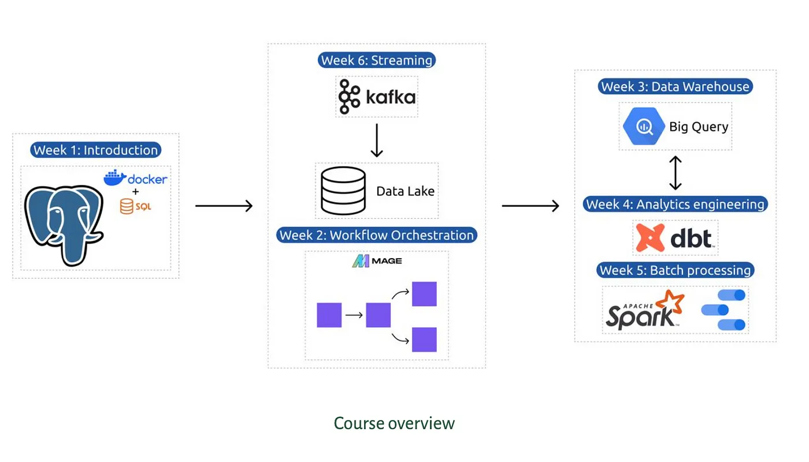

# Data Engineering Zoomcamp 2024 (self paced)

Welcome to the Data Engineering Zoomcamp repository! This repository contains materials and notes from the Data Engineering Zoomcamp course offered by [DataTalks.Club](https://datatalks.club/blog/data-engineering-zoomcamp.html). The course covers fundamental concepts, tools, and techniques in **Data Engineering**, equipping you with the skills necessary to build **data pipelines**, **manage large datasets**, and **optimize data workflows**.

*Official course link:* [GitHub repository](https://github.com/DataTalksClub/data-engineering-zoomcamp/tree/main)

## About the Course

Data Engineering Zoomcamp is designed for individuals interested in diving into the world of data engineering. Whether you're a beginner or an experienced professional looking to enhance your skills, this course provides comprehensive coverage of key topics in data engineering, including:

Introduction to Data Engineering
**Data Processing and Transformation**
**Data Storage and Management**
Building Data Pipelines
Big Data Technologies
Data Quality and Governance

## Syllabus

#### Data: [NYC TLC data](https://www.nyc.gov/site/tlc/about/tlc-trip-record-data.page)

CSV files: [CSVs](https://github.com/DataTalksClub/nyc-tlc-data)

This is the dataset we will be ingesting and storing into data warehouse using data engineering techniques.

### Module 1: Containerization and Infrastructure as Code [current]

- **Overview**: Introduction to the course and its objectives.
- **Technologies**: Google Cloud Platform (GCP), Docker, docker-compose.
- **Skills**: Running Postgres with Docker, setting up infrastructure on GCP using Terraform.
- **Homework**: Tasks to reinforce learning and prepare the environment for the course.
