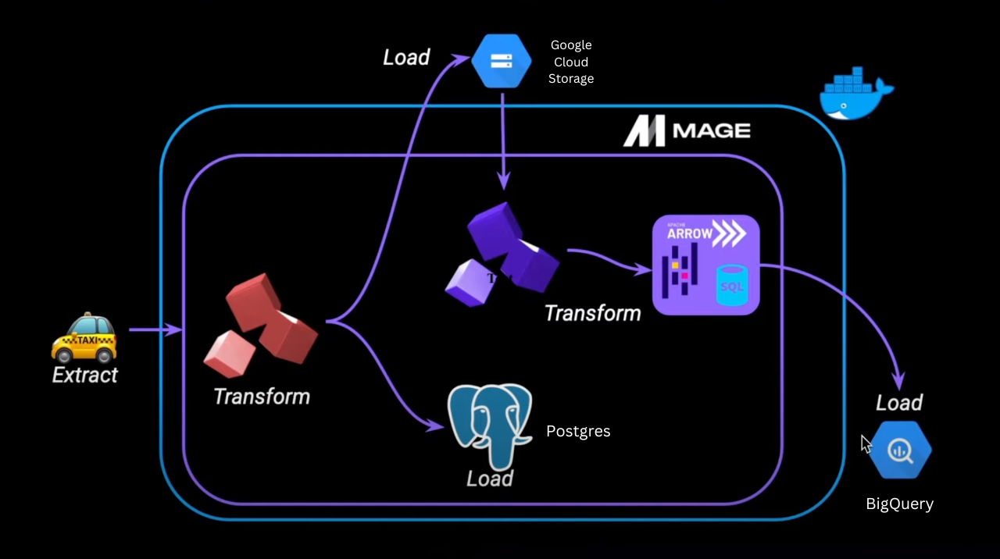

# Data Engineering Zoomcamp, Week 2

In Week 2 of the DTC Data Engineering Zoomcamp, we dive into the world of workflow orchestration using Mage. Imagine you're part of an F1 pit crew, where every move during a race can impact the outcome. Similarly, in data engineering, orchestration means carefully arranging tasks to make sure everything runs smoothly. This idea, nicely explained in 'Fundamentals of Data Engineering: Plan and Build Robust Data Systems' by Joe Reis, Matt Housley, et al., as '**the process of organizing many tasks to run efficiently on a set schedule**,' is fundamental in our field. It's all about arranging and managing tasks smartly to get the best results, just like ensuring a seamless pit stop during a race.

Imagine you're getting ready for a big race, like the Formula 1 Grand Prix. Each step, from checking the tires to fine-tuning the engine, is crucial for success, just like how workflow orchestration works in data engineering. This week, in the module called 'Workflow Orchestration,' [Matt Palmer](https://www.linkedin.com/in/matt-palmer/), an author and Relations Developer at Mage, guides us through creating an ETL pipeline with Mage. Our journey begins by gathering data (NY taxi data, in our case), organizing it for clarity, and then storing it in a PostgreSQL database and a Google Cloud Storage bucket. Just like the final race day everything comes together, our data, now polished and refined, is ready to be put to good use.



# Configuring Mage

Prior to getting into some of the key components of Mage, we need to setup our environment. If you haven't already, you'll need to clone the [Mage Zoomcamp repository](https://github.com/mage-ai/mage-zoomcamp) provided so we can setup our environment locally.

Assuming you've already completed the week 1 modules, starting up the environment should be pretty straightforward, but you can refer to the Readme file in the Mage repo if you run into any issues.

1. Clone repo to vscode
2. Open a terminal in your local repo directory
3. Run the following commands

```docker
docker compose build
```

Followed by

```docker
docker compose up
```

4. Navigate to [http://localhost:6789](http://localhost:6789/) in your browser

Now we can start building our pipeline!
